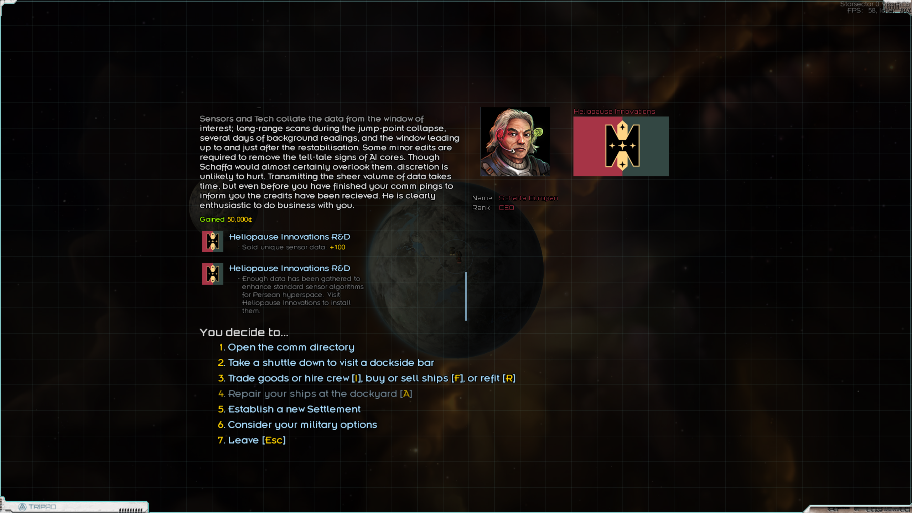
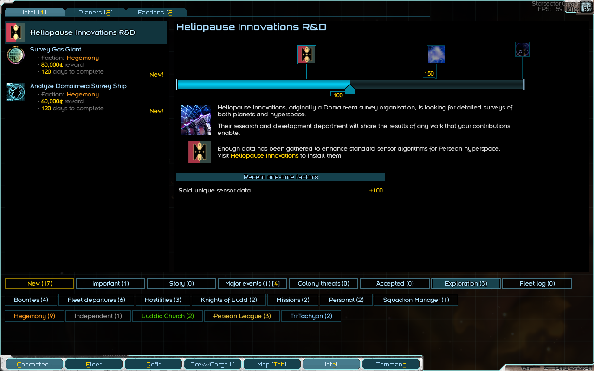
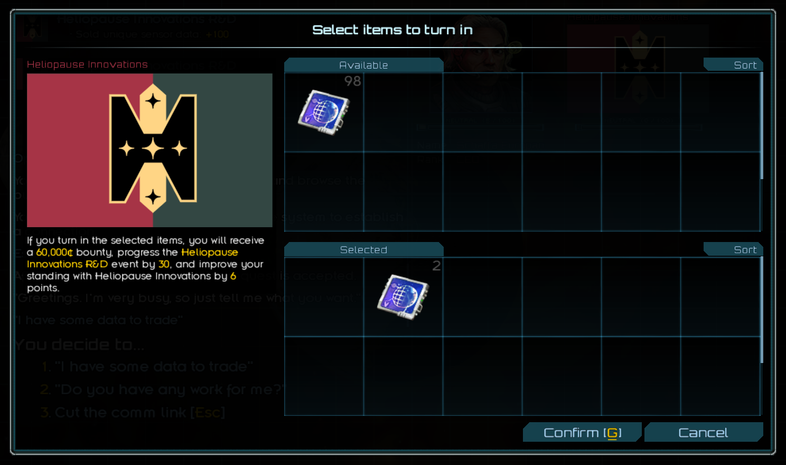
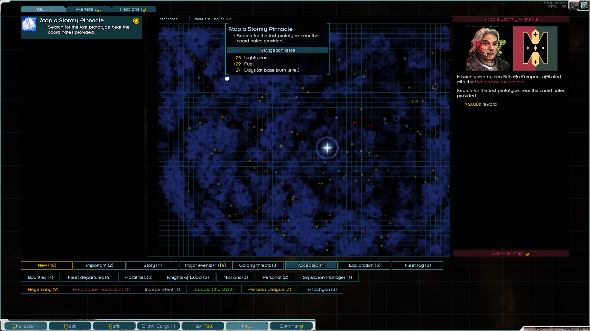
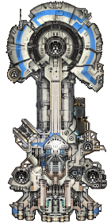
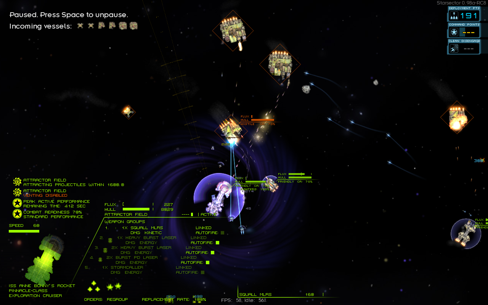
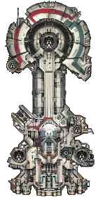

# Heliopause Innovations
`v0.1.0` for Starsector `0.98a-RC8`, made using Wisp's [IntelliJ Mod Template].

## Description

A mod that adds a small faction, Heliopause Innovations, a former contractor to the Domain Explorarium.
Buy ships designed to assist in exploration, deal in survey data, or help them recover a lost prototype.

## Installation

Download the latest `.zip` from the [Releases list](https://github.com/smangham/starsector-heliopause-innovations/releases),
extract to the `starsector-heliopause-innovations` directory, and place it in your `starsector/mods` directory then check it in the launcher.

Requires [LazyLib] & [MagicLib].

## Content

### New Campaign Content

The Domain megacorp Heliopause Innovations was originally a contractor to the Domain Explorarium, 
intended to follow up on drone surveys. Post-Collapse, it barely clings on to survival.

Visit the **CEO** on the planet **Ailmar**, in the **Westernesse** system, to start the new campaign content:

* **Submarket** - **Heliopause Innovations**:
  * Buy new ships from Heliopause's submarket.

* **Intel Event** - **Heliopause Innovations R&D**: 
  * Trade survey data to the CEO for reputation, credits, and event progress.
  * 
  * 

* **Mission** - **Atop A Stormy Pinnacle**: 
  * Unlocked by the R&D event, you'll be asked to recover the **Pinnacle Mk 1** from the depths of hyperspace.
  * 

* **Ability** - **Call Storm**:
  * Unlocked by the R&D event, gain an ability that lets fleets with a **Pinnacle** create hyperspace storms.

### New Ships

| **Pinnacle Cruiser**                                                                                                                                                                                                      | **Pinnacle Mk 1 Cruiser**                                                                | 
|---------------------------------------------------------------------------------------------------------------------------------------------------------------------------------------------------------------------------|------------------------------------------------------------------------------------------| 
| A modification of the Apogee that shields the rest of the fleet. Out of combat, it blocks damage from storm strikes at the cost of CR; in-combat, it can attract projectiles towards itself and its ablative drones.      | The original version of the **Pinnacle**, without drones but capable of phasing.         |
|  |                     |

Some variations on vanilla ships appear as enemies. 

### New Weapons

* **Stormcaller**: A built-in weapon on the **Pinnacle**, it surrounds the target with hyperspace stormclouds.
  The storm breaks over the next 10 seconds, dealing damage and significant knockback to ships caught within it.
  The weapon regains charges by using the **Pinnacle's** ship system to attract projectiles.

Some new weapons appear on the enemy ships.

### New Missions

There's two new missions available from the main menu:

* **Any Port in a Storm**: Help an independent fleet and its flagship **Pinnacle** fight off a Tri-Tachyon patrol.
* **Graveyard Bash**: Help an independent fleet escape from an unexpected new threat.

## Save Compatibility

* **Requires a new game**: The storm shielding functionality required modifying the `HyperspaceTerrainPlugin`, 
  which only updates on a new save.
* **Not safe to remove**: The modified `HyperspaceTerrainPlugin` is written into your save.

## References

* [IntelliJ Mod Template] by Wisp
* [Smooth Apogee Sprite] by Tartiflette

[GraphicsLib]: https://fractalsoftworks.com/forum/index.php?topic=10982.0
[MagicLib]: https://github.com/MagicLibStarsector/MagicLib/
[LazyLib]: https://github.com/LazyWizard/lazylib/
[IntelliJ Mod Template]: https://github.com/wispborne/Starsector-IntelliJ-Template
[Smooth Apogee Sprite]: https://fractalsoftworks.com/forum/index.php?topic=9320.0
